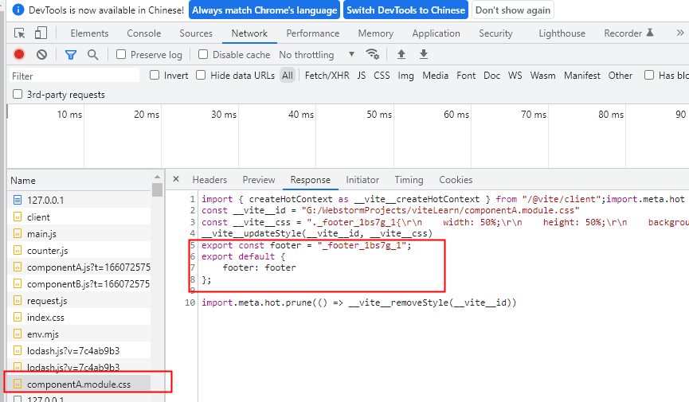

# 在vite 中处理css

vite天生就支持对css 文件的直接处理

1. vite在读取到main.js中引用到了index.css
2. 直接使用fs模块去读取index.css中文件的内容
3. 直接创建一个style标签,将index.css中的文件内容直接copy进style标签里
4. 将style标签插入到index.html的head中
5. 将该css文件中内容直接替换为js脚本(方便热更新或者css模块化),同时设置Content-type为js,从而让浏览器已JS脚本的形式来执行改css后缀的文件

场景:
协同开发时,双方使用同样的名称,可能会导致样式被覆盖

- 一个组件最外层的元素名称一般取名:wrapper
- 一个组件最底层的元素类名一般取名:footer

你去了footer这个名字,别人也可能取了footer这个类名,最终可能会导致样式被覆盖(因为类名重复)

cssmodule就是来解决 这个问题的

大致原理:全部都是基于node

1. module.css (module是一种约定,表示要开启css模块化)
2. 会将所有的类名进行一定规则的退换 (将footer替换为_footer_jsxfw_1)
3. 同时创建一个映射对象{footer:"_footer_jsxfw_1"}
4. 将替换过后的内容塞进style标签里然后放入head标签中(能够读到index.html的文件内容)
5. 将compontentA.module.css内容进行全部抹除,替换为JS脚本
6. 将创建的映射对象在脚本中默认导出.

