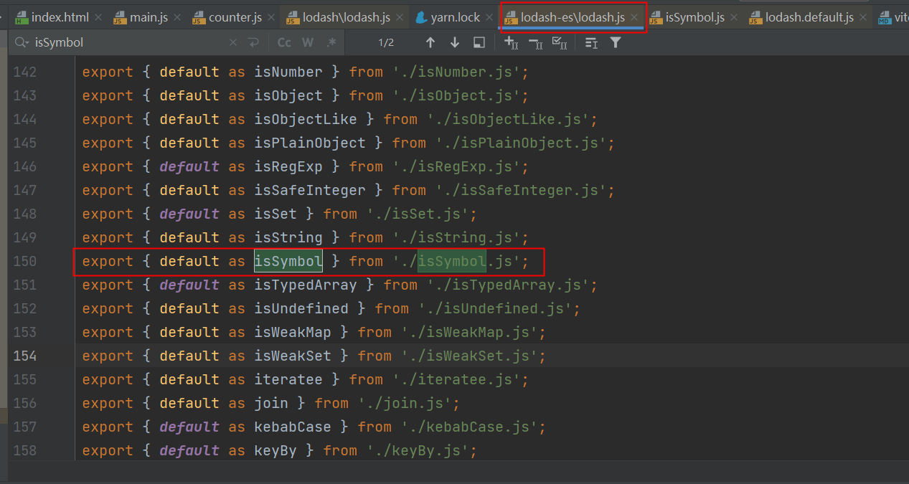
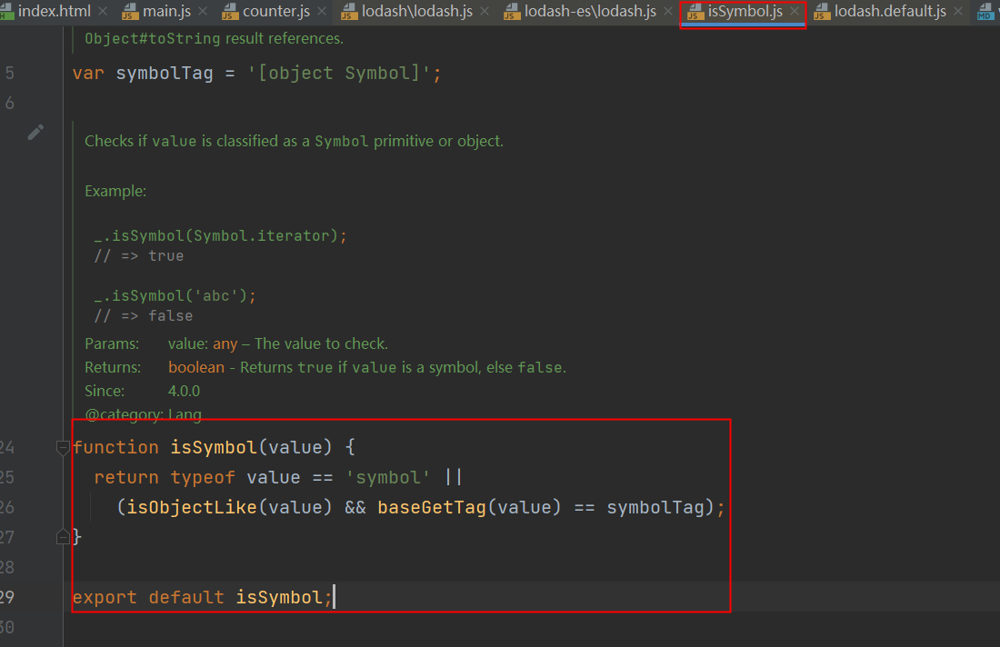
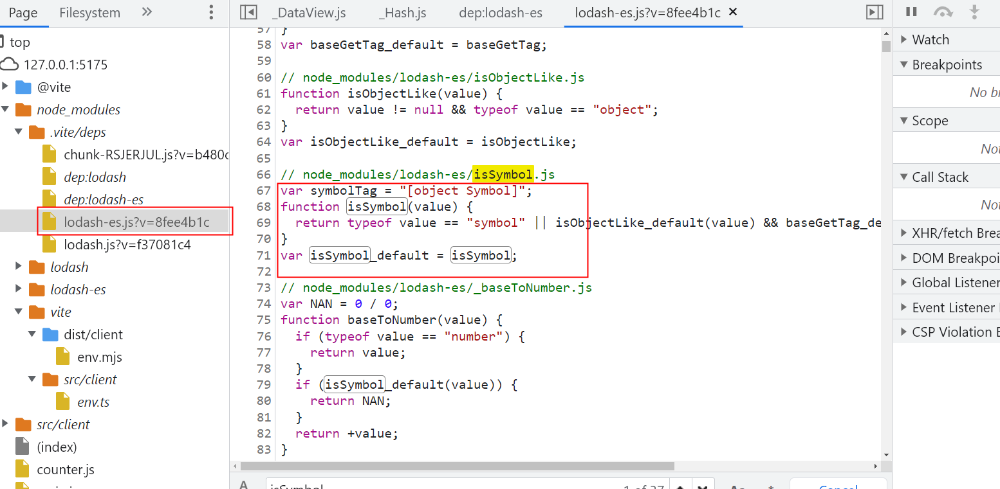

# vite的预加载
```js
import _ from "lodash"; //lodash 可能也import了其他的东西
```
在处理过程中如果看到有非绝对路径也非相对路径的引用，vite会尝试路径补全
```js
//将上面的补全为
import _ from "/node_module/.vite/lodash";
//vite编译后自动生成的
import __vite__cjsImport0_loadsh from "/node_modules/.vite/deps/loadsh.js?v=ada48b53";

```
找寻依赖的过程是自当前目录依次向撒花姑娘查找的过程,直到搜寻到根目录或搜选到对应的依赖为止

这会引发一个问题: 依赖如果在顶级目录 依赖的引用路径会变为 user/node_module/lodash, ../

开发:
yarn dev --> 开发 (每次依赖预构建所重重新构建的相对路径都是正确的) 
生产 
vite 打包 会全权交给一个叫做rollup的库去完成生产环境的打包


缓存--->
实际上vite在考虑另外的问题是就顺便解决了这个问题.

如果common.js的导出规范为 module.exports

**依赖预构建**首先vite 会找到对应的依赖,然后调用esbuild(对js语法进行处理的一个库),将其他的规范的代码转换成esmodule规范,然后再放到当前目录
下的node_module/.vite/deps,同时对esmodule规范的各个模块进行统一集成
```js
//a.js
export default function a(){}
```
```js
//index.js
export {default as a} from "./a.js"

//以上语句等同于
import a from "./a.js"
export const a = a;
```
vite重写后
```js
//index.js,直接将实现函数复写进来,就没有对应的import了
function a (){}

```

例如:
引用vite依赖预构建前:


依赖预构建后:直接将isSymbol的实现方法在lodash-es.js中实现.


```js
import __vite__cjsImport0_loadsh from "/node_modules/.vite/deps/loadsh.js?v=ada48b53";
```

这解决了3个问题:
1. 不同的第三方包含不同的导出格式(这个是vite无法约束第三方的事情)
2. 将所有的依赖都加载到本地来,对引用路径的处理上 都可以直接使用 .vite/deps,方便路径重写,不用考虑开发还是生产环境.
3. 网络多包传输的性能问题(在引入的包里又多重引用了其他的包)(这也是原生esmodule规范不敢支持node_modules的原因之一),有了依赖预构建以后无论有
多少额外的export和import,vite都会尽可能将他们进行集成最后只有一个或几个模块.(思路NB)

配置文件
vite.config.js  等同于 webpack.config.js
```js
export default{
    optimizeDeps:{
        exclude:["lodash-es"],//当遇到lodsh-es这个依赖时不进行依赖预构建
    }
}
```


