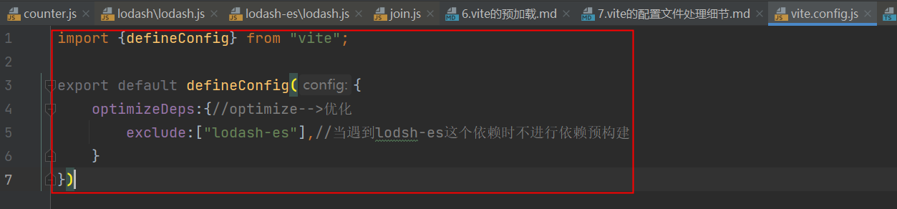
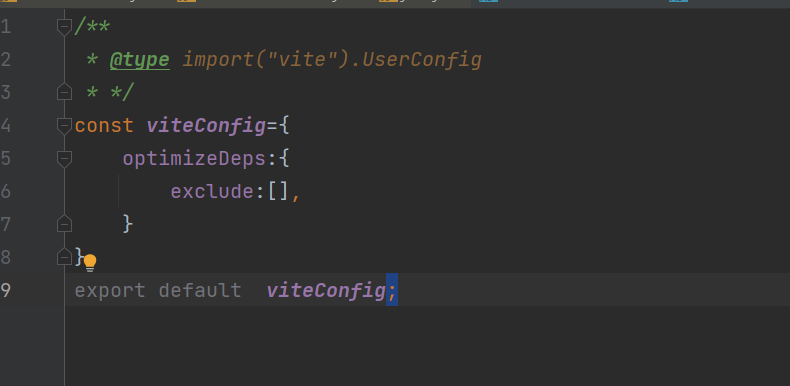

# vite配置文件处理细节

1. vite文件的语法提示
    1. 如果使用的是webStrom,可以得到很好的语法提示
    2. 如果使用的是vscode或其他编辑器,则需要做些特殊处理
        1. 使用 defineConfig,参照vite.config.js中的defineConfig用法
       
        2. 使用@type注释
2. 关于环境的配置
   过去使用webpack的时候,需要区分配置文件的环境
   - webpack.dev.config
   - webpack.prod.config
   - webpack.base.config
   - webpackmarge

