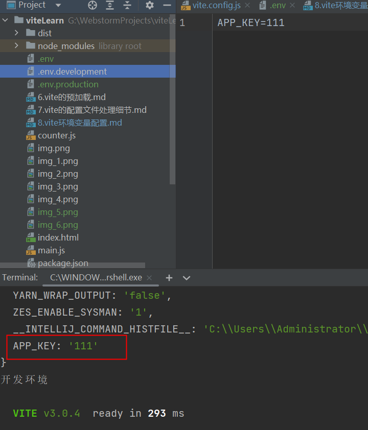

环境变量.

- 开发
- 测试
- 预发布
- 灰度
- 生产


引用第三方sdk,会根据不同编译环境使用不同的key,secret等配置.
要求,编译根据不同的环境,自动配置相应的参数.

在vite中环境变量处理:

vite 内置了 dotenv这个第三方库

dotenv会自动读取.env文件,并将这个文件中的对应环境变量并将其注入到process对象下(但是vite 考虑到和其他的配置的一些冲突问题,不会直接注入到
process对象下)

涉及到vite.config.js中的一些配置
- root
- envDir 用来配置读取.env的路径(就是按照这个配置去对应位置读取.env 文件)

vite给我们提供了一些补偿措施,我们可以用vite的loadEnv来手动确认env文件

process.cwd方法:返回当前node进程的工作目录

.env:所有环境都需要用到的环境变量
.env.development 开发环境需要用到的环境变量
.env.production  生产环境需要用到的环境变量

yarn dev --mode development 会将mode设置为development传递进来

当我们调用loadenv的时候,会做如下几件事:
1. 直接找到.env文件不解释,并解析其中的环境变量 并放进一个对象里
2. 会将传进来的mode这个变量的值进行拼接:```.env.mode-->.env.development ```,并根据我们提供的配置文件所在
目录去取对应的配置文件进行解析,并放入一个对象中
3. 我们可以理解为
```js
 const baseEnvConfig =读取的.env的配置
 const modeEnvConfig =读取的.env的配置(例如.env.development)
 const lastEnvConfig ={...baseEnvConfig,...modeEnvConfig}//重名的配置,会后面的覆盖前面的
```


编译后,打印出来APP_KEY为111



补充小知识:为什么 vite.config.js可以书写程esmodule的形式.

这是因为vite在读取vite.config.js的时候会 在node之前去解析文件语法,如果发现是esmodule语法,会直接将esmodule规范转换为commonjs规范.\
(原理就是:直接使用String的replace方法将 esmodule规范的import export 替换为 module.import module.export)
***
yarn build 报错

must use import to load es module:

百度,google一遍都不适用

最后解决办法是:将package.json中"lodash-es": "^4.17.21",依赖***移除***,再重新安装后解决
***